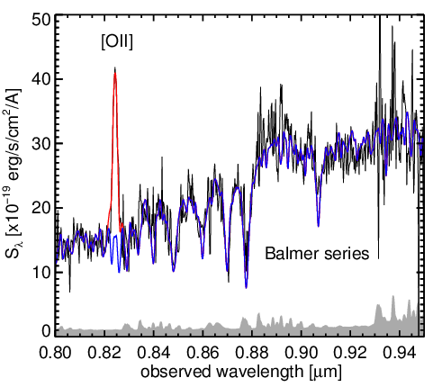
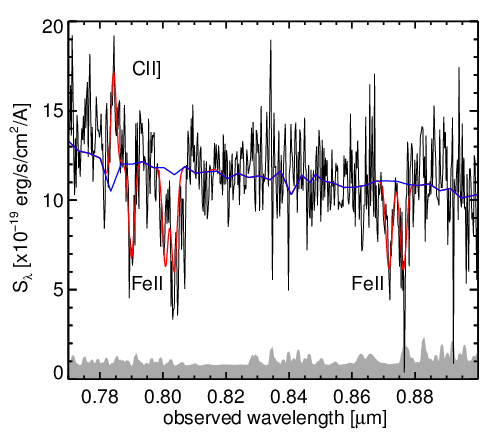

# slinefit

```slinefit``` is a simple software that can be used to derive spectroscopic redshifts from 1D spectra, and measure line properties (fluxes, velocity width, velocity offset, ...). Here is the list of the main features and facts:

* Reads the 1D flux and error spectra from a FITS file, wavelengths from the WCS data.
* Frequencies are supported too!
* Performs a brute-force redshift scan over a fixed interval.
* Lines can be chosen from a pre-defined list; more can be added from the command line.
* Lines can be emission or absorption lines.
* Lines have Gaussian velocity profiles, formally integrated over each spectral element.
* Line velocity widths can be varied, optionally constrained to be the same for all lines.
* Lines can optionally have variable velocity offsets.
* Lines can optionally have multiple velocity components, with different widths and offsets.
* One or more continuum templates can be fit simultaneously with the lines.
* The best redshift and its probability distribution are determined from the chi2.
* Accurate uncertainties on line properties can be derived using Monte Carlo simulations.
* Can use multi-threading to speed up the Monte Carlo simulations.
* Outputs redshift, line fluxes, widths, offsets and rest-frame equivalent widths.
* Can output results in both FITS and ASCII format.
* Has been used to fit spectra from VIMOS, KMOS, X-SHOOTER, MOSFIRE, ALMA and VLA.


# Typical usage

Usually you will want to run a "first pass" to measure the redshift, which is pretty fast. For example, on my desktop computer, the code takes 7 seconds to find the redshift of a galaxy with one continuum template (typically the best-fit template obtained from a fit to the photometry with your favorite photometric redshift code) and five emission lines. This is using a 1D spectrum with about 1000 spectral elements (R~3000), scanning 8000 possible redshifts between z=2 and z=5 with 2 possible line widths, and without Monte Carlo simulations. This is the command that was used:
```
slinefit spectrum.fits z0=3.5 dz=1.5 delta_z=1 width_min=60 width_max=300 delta_width=2 \
    same_width use_global_chi2 full_range fit_continuum_template verbose \
    lines=[em_halpha,em_n2_6583,em_o3_5007,em_hbeta,em_o2_3727]

# Notes:
# - 'z0=3.5 dz=1.5' means we will scan redshifts from 2 to 5.
#
# - 'delta_z' and 'delta_width' are specified in terms of resolution elements. So 'delta_z=1'
#   means that we will build the redshift grid with a step such that an emission line would
#   move by roughly one spectral element from one redshift to the next.
#
# - 'use_global_chi2' and 'full_range' force the fit to use the entire spectrum to compute
#   the chi2 and fit the continuum, not only the regions surrounding potential lines. This
#   is good for a redshift search.
#
# - 'fit_continuum_template' allows the program to fit one ore more templates for the
#   continuum level, the templates must be in the "templates" sub-folder with *.dat extension.
#
# - 'lines' specifies which lines to use, here Halpha, [NII], [OIII], Hbeta and [OII]. These
#   are the brightest lines, and will be enough to find the redshift if some lines are indeed
#   present in the spectrum.
```

Once the redshift is known, you will want to do a "second pass" where line properties are varied on a finer grid, where fainter lines are added, or where the continuum is modeled with more templates. For example, on the same computer, it takes about 2 minutes to measure the properties of 14 lines, with 6 continuum templates, 25 different redshifts (```dz=0.002```, centered on the known zspec), 9 possible line widths (with a step of 50 km/s), and 41 velocity offsets (step of 50 km/s). The most time-consuming step is the Monte Carlo simulation (performing the fit itself takes about one second).
```
slinefit spectrum.fits z0=2.369 dz=0.002 delta_z=0.5 width_min=50 width_max=500 delta_width=0.5 \
    same_width allow_offsets offset_max=1000 delta_offset=0.5 fit_continuum_template verbose \
    num_mc=200 threads=8

# Notes:
# - Here we have decreased 'delta_z' and 'delta_width', so the grid became finer.
#
# - We have reduced 'dz' because we know the redshift, we just want to refine it.
#
# - We have increased the range of possible line widths using 'width_min' and 'width_max'.
#
# - We now 'allow_offsets', so bright lines can be shifted in velocity up to 'offset_max'.
#
# - The list of emission lines has been omitted, so the program will try to fit all the lines
#   that it knows about (run "slinefit list_lines" to see the list).
#
# - We have enabled Monte Carlo simulations with 'num_mc=200', so the program will perturb
#   the input spectrum 200 times and refit the lines each time.
#
# - We allowed the program to use up to 8 concurrent threads with the 'threads' option.
```

More detailed information can be obtained by calling ```slinefit``` without arguments. There are a lots of small tweaks you can apply using command line options, do take a look!

Below are two examples of fits obtained with ```slinefit```. The first is a fit of the [OII] line on top of strong continuum with Balmer absorption (the absorption lines are part of the continuum template, which is was created with the Bruzual & Charlot 2003 models). The second is a rest-FUV spectrum with the CII] emission line and several FeII absorption lines.

 

# Install instructions

To install ```slinefit```, you first need to build it. For this, you will need a recent C++ compiler, [git](https://git-scm.com/) and [CMake](https://cmake.org/). All of these tools are available by default on most modern linux distributions, and for MacOS you may need to install them with MacPorts. From there installing ```slinefit``` is very easy. Navigate to a directory of your choosing where the code will be downloaded (it will be placed in a subdirectory called ```slinefit```), then execute the following commands:
```
# Download the code and dependencies
git clone https://github.com/cschreib/slinefit.git
cd slinefit

# Compile
mkdir build
cd build
cmake ../
make install
```

This will create an executable called ```slinefit``` in the ```slinefit/bin``` directory, which you can use immediately. A default set of continuum template can be found in ```slinefit/bin/templates```; these correspond to the template set of EAzY (Brammer et al. 2008), for which I increased the spectral resolution by fitting them with FAST (Kriek et al. 2009).
