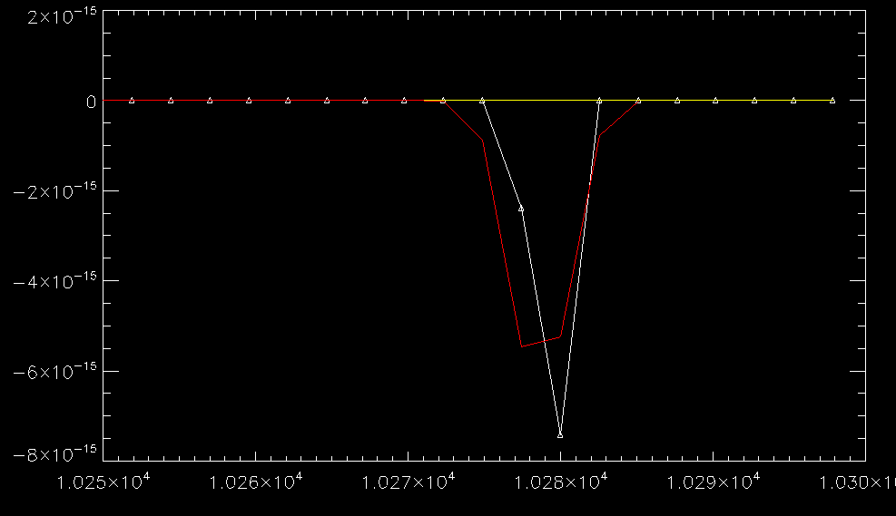

# slinefit tutorial

This tutorial will guide you through the analysis of an example spectrum observed with VIMOS on the VLT (taken from the VANDELS DR2). We will get a first fit running, and then see how it can be improved by using a number of command line options. Nothing in this tutorial is really specific to VIMOS, and the informations and techniques essentially apply to any spectrum.

<!-- MarkdownTOC autolink="true" -->

- [Setting up slinefit](#setting-up-slinefit)
- [Setting up the initial run](#setting-up-the-initial-run)
    - [The input file, and FITS extensions](#the-input-file-and-fits-extensions)
    - [The redshift and line grids](#the-redshift-and-line-grids)
    - [Fixing the FITS header](#fixing-the-fits-header)
    - [A first \(not very good\) run](#a-first-not-very-good-run)
- [Improving the fit](#improving-the-fit)
    - [Visualizing the fit](#visualizing-the-fit)
    - [Cutting corrupted edges](#cutting-corrupted-edges)
    - [Fitting the continuum](#fitting-the-continuum)
    - [Automatic rescaling of uncertainties](#automatic-rescaling-of-uncertainties)
    - [Refining the fit](#refining-the-fit)
    - [More refining](#more-refining)
    - [Adding more lines](#adding-more-lines)
- [Line fluxes, widths, and error bars](#line-fluxes-widths-and-error-bars)
    - [Reading the output of the fit](#reading-the-output-of-the-fit)
    - [Better uncertainties](#better-uncertainties)
- [Conclusion](#conclusion)

<!-- /MarkdownTOC -->


# Setting up slinefit

To install slinefit, please follow the instructions given in the README. In what follows, I will assume you have installed slinefit in the ```/home/user/programs/slinefit/``` directory, but you can of course install the program anywhere else, provided you update the path to the program in the instructions below. Consequently, the program slinefit is located in ```/home/user/programs/slinefit/bin/slinefit```.


# Setting up the initial run

## The input file, and FITS extensions

In this directory, you will find a FITS file called ```sc_CDFS006664_P1M2Q4_P2M1Q4_003_1.fits```, which was taken straight from the VANDELS DR2 data base. To run slinefit on this spectrum, we must supply the name of the FITS file as first argument to the program:

```bash
/home/user/programs/slinefit/bin/slinefit sc_CDFS006664_P1M2Q4_P2M1Q4_003_1.fits
```

Do not attempt to run this yet, however. We have to set a number of important command line options for the fit to proceed correctly.

First, this file contains a number of FITS extensions each containing different data. For more information on the format of the FITS files that slinefit can deal with, please look at the README file. In particular, this file contains the flux in the primary FITS HDU, and the uncertainty (or noise, or error) spectrum in the third extension. But slinefit assumes a different format by default, so we have to let it know where to look for the data. This is done with the ```flux_hdu``` and ```error_hdu``` options:

```bash
/home/user/programs/slinefit/bin/slinefit sc_CDFS006664_P1M2Q4_P2M1Q4_003_1.fits \
    flux_hdu=0 error_hdu=3
```

## The redshift and line grids

If you try to run the command above, you will see that the program fails with several error messages:

```bash
error: please provide the fiducial redshift z0=...
error: please provide the name of an emission line(s) to fit with lines=[...]
note: available lines:
...
```

Indeed, the way slinefit works is that you must provide it with a first guess of the redshift (```z0```), a range of redshifts to explore around this value (```dz```), and a set of emission lines to look for (```lines```). Let's do this step by step.

This VANDELS spectrum already has a redshift estimate in the header (```HIERARCH PND Z``` keyword), which is ```z=2.8895```. In this tutorial we will ignore this redshift and try to determine our own estimate. Suppose we had a photometric redshift for this object that gave us ```z=2.9 +/- 0.2```. We will therefore use ```z0=2.9``` as a starting point, and to make sure we cover all the possibilities allowed by the photometric redshift we will scan a range of ```dz=0.6``` around this value. This will scan redshifts from ```2.3``` to ```3.5```. Therefore we now have the command:

```bash
/home/user/programs/slinefit/bin/slinefit sc_CDFS006664_P1M2Q4_P2M1Q4_003_1.fits \
    flux_hdu=0 error_hdu=3 z0=2.9 dz=0.6
```

By default, the program will scan a fine grid of redshifts: the default redshift step is such that a line would move by just one fifth of a pixel (or spectral element). This is controlled by the ```delta_z``` keyword. Such a small step is good for getting the most precise measurement of the redshift, but at this stage we just want to have a first estimate. We will therefore scan with a step of one pixel (given the spectral resolution of the spectrum, ```R=3000```, this is roughly a step of ```0.0003``` in redshift). We therefore set ```delta_z=1```:

```bash
/home/user/programs/slinefit/bin/slinefit sc_CDFS006664_P1M2Q4_P2M1Q4_003_1.fits \
    flux_hdu=0 error_hdu=3 z0=2.9 dz=0.6 delta_z=1
```

Now we need to define which emission line to look for. This is done by listing the lines in the ```lines=[...]``` option, where the ```...``` in brackets must be a comma-separated list (without spaces) of emission line names. The list of all emission line name available by default in the program can be seen by calling the slinefit program without any argument:

```bash
/home/user/programs/slinefit/bin/slinefit
```

This will display the command line help for the program. Among other things, it will also print the list of all the supported lines:

```bash
Available lines:
  - abs_al2_1671, lambda=0.16708 (Aluminum II  -- AlII)
  - abs_al3_1855, lambda={0.18547, 0.18628}, ratios={1, 1} (Aluminum III -- AlIII (doublet))
  - abs_c2_1335, lambda=0.13345 (Carbon II -- CII)
  - abs_c3_1176, lambda=0.11755 (Carbon III -- CIII)
  - abs_fe2_1608, lambda={0.16085, 0.16112}, ratios={1, 1} (Iron II -- FeII (doublet))
  - abs_fe2_2344, lambda=0.23442 (Iron II -- FeII)
  - abs_fe2_2380, lambda={0.23745, 0.23828}, ratios={1, 1} (Iron II -- FeII (doublet))
  - abs_fe2_2600, lambda={0.25867, 0.26002}, ratios={1, 1} (Iron II -- FeII (doublet))
  - abs_o1_1302, lambda=0.13022 (Oxygen I -- OI)
  - abs_o4_1342, lambda=0.13416 (Oxygen IV -- OIV)
  - abs_s5_1502, lambda=0.15018 (Sulfur V -- SV)
  - abs_si2_1260, lambda=0.12604 (Silicium II -- SiII)
  - abs_si2_1304, lambda=0.13043 (Silicium II -- SiII)
  - abs_si2_1526, lambda=0.15267 (Silicium II -- SiII)
  - em_c1_370, lambda=370.42 (Carbon I -- CI)
  - em_c1_609, lambda=609.14 (Carbon I -- CI)
  - em_c2_157, lambda=157.741 (Carbon II --- [CII])
  - em_c2_2326, lambda={0.23235, 0.23247}, ratios={1, 1} (Carbon II -- CII] (doublet))
  - em_c3_1909, lambda=0.19087 (Carbon III -- CIII])
  - em_c4_1550, lambda={0.15482, 0.15508}, ratios={1, 1} (Carbon IV -- CIV (doublet))
  - em_co10, lambda=2600.75 (Carbon Monoxyde -- CO(1-0))
  - em_co21, lambda=1300.4 (Carbon Monoxyde -- CO(2-1))
  - em_co32, lambda=866.96 (Carbon Monoxyde -- CO(3-2))
  - em_co43, lambda=650.25 (Carbon Monoxyde -- CO(4-3))
  - em_co54, lambda=520.23 (Carbon Monoxyde -- CO(5-4))
  - em_co65, lambda=433.57 (Carbon Monoxyde -- CO(6-5))
  - em_co76, lambda=371.65 (Carbon Monoxyde -- CO(7-6))
  - em_co87, lambda=325.23 (Carbon Monoxyde -- CO(8-7))
  - em_co98, lambda=298.12 (Carbon Monoxyde -- CO(9-8))
  - em_halpha, lambda=0.65628 (Hydrogen alpha)
  - em_hbeta, lambda=0.48613 (Hydrogen beta)
  - em_hdelta, lambda=0.41017 (Hydrogen delta)
  - em_he2_1640, lambda=0.16404 (Helium II -- HeII)
  - em_hgamma, lambda=0.43405 (Hydrogen gamma)
  - em_lyalpha, lambda=0.12157 (Lyman alpha)
  - em_mg2_2799, lambda={0.27964, 0.28035}, ratios={1, 1} (Magnesium II  -- MgII (doublet))
  - em_n2_6583, lambda={0.65835, 0.6548}, ratios={1, 0.3} (Nitrogen II -- [NII] (doublet))
  - em_n5_1240, lambda={0.12388, 0.12428}, ratios={1, 1} (Nitrogen V -- NV (doublet))
  - em_ne3_3869, lambda=0.38688 (Neon III -- NeIII)
  - em_ne4_2422, lambda=0.24218 (Neon IV -- NeIV)
  - em_ne5_3426, lambda=0.34259 (Neon V -- NeV)
  - em_o1_145, lambda=145.525 (Oxygen I --- [OI])
  - em_o2_3727, lambda={0.3726, 0.37288}, ratios={1, 1} (Oxygen II -- [OII] (doublet))
  - em_o3_5007, lambda={0.50068, 0.49589}, ratios={1, 0.3} (Oxygen III -- [OIII] (doublet))
  - em_palpha, lambda=1.87513 (Pashen alpha)
  - em_s2_6717, lambda={0.67164, 0.67308}, ratios={1, 0.75} (Sulfur II -- [SII] (doublet))
  - em_si4_1400, lambda={0.13938, 0.14028}, ratios={1, 1} (Silicium IV -- SiIV (doublet))
```

The name of the line is the first element of each item on this list. For example ```em_o2_3727``` is the code name for the [OII] emission line (```em``` is for lines that are typically found in emission, and ```abs``` for absorption, but this is only indicative). In the line list used for the fit, we can specify as many lines as we wish. The program is smart enough to detect when a line is not covered, and it will simply ignore it. It would therefore be tempting to include all the lines, and let the code figure out which ones are indeed detected in the spectrum. This is fine if we already know the redshift. However, for a redshift search this can be dangerous: the program has no knowledge of which line is usually brighter or fainter. Therefore, if you specify too many possible lines and you are out of luck, the program may find a strong emission line (which should be, e.g., [OII]) but associate it to an priori weak line, which we know should not be the brightest line in the spectrum (e.g., [HeII] at 1640A).

In our case, this is an optical spectrum of a ```z=3``` galaxy; we know that there is little chance to see emission lines like H-alpha, because at this redshift they are moved into the near infrared domain. Instead, our spectrum is probing the rest-frame UV domain, from roughly 1200 to 2600 Angstroms. In this wavelength regime, there are only a few bright emission lines: Ly-alpha, [MgII]2799, and [OII]3727. There are also a couple of strong absorption lines (e.g., Steidel et al. 2010): SiII 1260, OI 1302, CII 1335, SiIV 1400, SiII 1526, CIV 1550. We will therefore go with this list:

```bash
/home/user/programs/slinefit/bin/slinefit sc_CDFS006664_P1M2Q4_P2M1Q4_003_1.fits \
    flux_hdu=0 error_hdu=3 z0=2.9 dz=0.6 delta_z=1 \
    lines=[em_lyalpha,em_mg2_2799,em_o2_3727,abs_si2_1260,abs_o1_1302,abs_c2_1335,em_si4_1400,abs_si2_1526,em_c4_1550]
```

The program will then attempt to fit each of these lines with a variable flux and line width. As for the redshift, the line widths are varied on a grid from ```width_min``` to ```width_max``` (default 50 and 1000 km/s, respectively, which we will not modify here), and with a fixed step controlled by the ```delta_width``` option. By default the step in line widths is relatively small to allow for precise measurements (also a fifth of a pixel, as for the redshift). But again, for our first run this step is too small, so we will increase it a bit to one pixel (```delta_width=1```, which corresponds to a step of ```110``` km/s in the velocity dispersion for this spectrum with ```R=3000```):

```bash
/home/user/programs/slinefit/bin/slinefit sc_CDFS006664_P1M2Q4_P2M1Q4_003_1.fits \
    flux_hdu=0 error_hdu=3 z0=2.9 dz=0.6 delta_z=1 delta_width=1 \
    lines=[em_lyalpha,em_mg2_2799,em_o2_3727,abs_si2_1260,abs_o1_1302,abs_c2_1335,em_si4_1400,abs_si2_1526,em_c4_1550]
```

Finally, we will also add the ```verbose``` option, so the code will print a summary of its progress in the terminal as the calculation goes on:

```bash
/home/user/programs/slinefit/bin/slinefit sc_CDFS006664_P1M2Q4_P2M1Q4_003_1.fits \
    flux_hdu=0 error_hdu=3 z0=2.9 dz=0.6 delta_z=1 delta_width=1 verbose \
    lines=[em_lyalpha,em_mg2_2799,em_o2_3727,abs_si2_1260,abs_o1_1302,abs_c2_1335,em_si4_1400,abs_si2_1526,em_c4_1550]
```

## Fixing the FITS header

If we run the command above, however, we get another error message:
```bash
note: read input spectrum...
error: reading sc_CDFS006664_P1M2Q4_P2M1Q4_003_1.fits
error: could not find unit of wavelength axis (missing CUNIT1 keyword)
```

It looks like the input spectrum is broken, and the program cannot read the unit of the spectral axis. This if of course crucial, because the unit could be anything from Angstroms to meters. It turns out, in this case this happens because the spectrum is missing the ```CUNIT1``` FITS keyword. This is a fault in the input spectrum, and ideally we would ask the person who produced it to fix their pipeline to always add the ```CUNIT``` keyword. But for now we will just add this keyword ourselves. There are a multitude of ways of doing this. Here we will use a brute force method, by replacing a useless keyword:

```bash
# Warning: make sure you copy the entire command at once to run it in Bash
# and that you get to the end of the "sed ..." line (there are a lot of blank spaces
# but they are important).
cat sc_CDFS006664_P1M2Q4_P2M1Q4_003_1.fits | \
    sed "s/HIERARCH PND FILE ID = 'ce7489726d481715e83779460408ce60'/CUNIT1  = 'Angstrom'                                     /g" > \
    sc_CDFS006664_P1M2Q4_P2M1Q4_003_1_fixed.fits
```

This creates a new spectrum ```sc_CDFS006664_P1M2Q4_P2M1Q4_003_1_fixed.fits``` with the proper keyword set. The new command is then:

```bash
/home/user/programs/slinefit/bin/slinefit sc_CDFS006664_P1M2Q4_P2M1Q4_003_1_fixed.fits \
    flux_hdu=0 error_hdu=3 z0=2.9 dz=0.6 delta_z=1 delta_width=1 verbose \
    lines=[em_lyalpha,em_mg2_2799,em_o2_3727,abs_si2_1260,abs_o1_1302,abs_c2_1335,em_si4_1400,abs_si2_1526,em_c4_1550]
```

## A first (not very good) run

You can now run the command, and get your first fit running! Congratulations. On my computer, this takes only one second to run. It returns a best fit redshift of ```z=2.67568```, which is surprisingly different from the redshift that was given to us in the header, but also the reduced chi squared value is horribly wrong: ```56028```. For a good fit, this value should be close to one. Obviously, something has gone wrong... Let's see how we can fix this.


# Improving the fit

## Visualizing the fit

In all cases, it is always advisable to visually inspect the spectrum and the best fit model together, to see if all is as we expect. By default slinefit does not write the best fit model, but we can ask it to do so by adding the ```save_model``` option:

```bash
/home/user/programs/slinefit/bin/slinefit sc_CDFS006664_P1M2Q4_P2M1Q4_003_1_fixed.fits \
    flux_hdu=0 error_hdu=3 z0=2.9 dz=0.6 delta_z=1 delta_width=1 verbose save_model \
    lines=[em_lyalpha,em_mg2_2799,em_o2_3727,abs_si2_1260,abs_o1_1302,abs_c2_1335,em_si4_1400,abs_si2_1526,em_c4_1550]
```

This will create a file called ```sc_CDFS006664_P1M2Q4_P2M1Q4_003_1_fixed_slfit_model.fits```. It is a FITS file containing the best model 1D spectrum in the first extension. To visualize this, you can use any program of your choice (Python, IDL, etc.) provided you can open FITS files and make a simple plot. I will use IDL in the following, but there's nothing specific to IDL in any of this.

```idl
filebase = 'sc_CDFS006664_P1M2Q4_P2M1Q4_003_1_fixed'
; Read the flux spectrum
f = mrdfits(filebase+'.fits', 0, hdr, /silent)
; Read the error spectrum
e = mrdfits(filebase+'.fits', 3, /silent)
; Read the best fit model
m = mrdfits(filebase+'_slfit_model.fits', 1, /silent)
; Create the wavelength axis
l = (dindgen(n_elements(f))+1 - sxpar(hdr, 'CRPIX1'))*sxpar(hdr, 'CDELT1') + sxpar(hdr, 'CRVAL1')

; Plot the spectrum in white and the model in red
plot, l, f
oplot, l, m, color='ff'x
```

This produces the following:


Something is obviously wrong with the data, there seems to be a strong negative spike at 10300A and the model attempts to reproduce it as best it can. This could be just noise though. Let's look at it in more detail by zooming in on the area of interest:

```idl
# Plot the flux in white, the uncertainty in yellow, the model in red
plot, l, f, xrange=[10250,10300], psym=-5
oplot, l, e, color='ffff'x
oplot, l, m, color='ff'x
```



The spike is relatively narrow, just two spectral elements, but the error spectrum is very small at that location; we would not expect such a strong negative value just from the noise. The data was probably corrupted here.

## Cutting corrupted edges

This is a relatively frequent case, where the edges of a spectrum are corrupted or extremely noisy. For this reason, slinefit allows you to discard a chosen number of spectral elements at the edge of the spectrum. This is done with the ```lambda_pad``` option. By default it is set at 5, which excludes the first and last 5 elements of the spectrum. Given the plot above, it seems we should probably increase this value, for example to 11:

```bash
/home/user/programs/slinefit/bin/slinefit sc_CDFS006664_P1M2Q4_P2M1Q4_003_1_fixed.fits \
    flux_hdu=0 error_hdu=3 z0=2.9 dz=0.6 delta_z=1 delta_width=1 verbose save_model lambda_pad=11 \
    lines=[em_lyalpha,em_mg2_2799,em_o2_3727,abs_si2_1260,abs_o1_1302,abs_c2_1335,em_si4_1400,abs_si2_1526,em_c4_1550]
```

This definitely changed things. The best fit redshift is now ```z=3.37703```, and the reduced chi squared has dropped to ```187```. This is much better, but still terrible!

## Fitting the continuum

Let's look again at the model and the spectrum:

```idl
# Make sure you read again the files... (not shown here for clarity)
# Plot the flux in white, the model in red
# (we truncate the Y range to the range covered by the model, to avoid the big negative spike)
plot, l, f, yrange=[min(m), max(m)]
oplot, l, m, color='ff'x
```


Ah. It seems there is some clear continuum flux in this spectrum, but currently we are only modeling lines. Let's improve this.

In slinefit, there are two ways to model the continuum. The first and simplest method fits a constant "pedestal" around each line. It is enabled with the option ```local_continuum```, while ```local_continuum_width``` controls the width (in km/s) of the pedestal. This is only useful when modeling a single line however; when fitting multiple lines over such a long wavelength range, this is far from optimal, but you can give it a try and see for yourself.

A better alternative is to provide the code with a set of galaxy templates that it can use to model the continuum. This is done with the option ```fit_continuum_template```, and the ```template_dir``` option is used to indicate in which folder to look for these templates. Each template must be provided in a separate ASCII file with the ```.dat``` extension. The file is then a simple two-column table where the first column is the wavelength in Angstrom and the second column is the flux density per unit wavelength (e.g., erg/s/cm2/A would work, but not Jansky or W/m2/Hz).

For convenience, slinefit comes with a set of pre-defined templates in the ```slinefit/bin/templates``` folder, and we will use these for this tutorial for simplicity. Ideally one would use a single template (or a set of templates) that is tailored for the source to fit (for example, the best fit template obtained when computing the photo-z). The command is now:

```bash
/home/user/programs/slinefit/bin/slinefit sc_CDFS006664_P1M2Q4_P2M1Q4_003_1_fixed.fits \
    flux_hdu=0 error_hdu=3 z0=2.9 dz=0.6 delta_z=1 delta_width=1 verbose save_model lambda_pad=11 \
    fit_continuum_template template_dir=/home/user/programs/slinefit/bin/templates \
    lines=[em_lyalpha,em_mg2_2799,em_o2_3727,abs_si2_1260,abs_o1_1302,abs_c2_1335,em_si4_1400,abs_si2_1526,em_c4_1550]
```

This produces a redshift of ```z=2.88784``` (very close to the redshift given in the header, ```z=2.8895```),  and a reduced chi squared of ```8.35```, which is again a huge improvement but still not very good. Let's look a the fit:


It looks like the code has found a decent model for the continuum emission, and it is seeing some absorption lines between 4000 and 6000 Angstrom.

## Automatic rescaling of uncertainties

The fit now looks good, so we are getting closer, but a reduced chi squared of ```8``` is still not acceptable. At this level, this can mean a number of things. First, it could mean that our model is not good (we may be missing some important lines, or we are not searching the right redshift range). Based on the plot above, it does not appear that there is an area where the model is obviously bad however. The alternative is that the error spectrum is not accurate. This is a pretty common situation when the error spectrum is determined by a pipeline by simply propagating the Poisson statistics, because it will not take into account other forms of noise or systematics (for example, variation in atmospheric transmission, inaccuracies in the sky subtraction, etc).

To cope for this issue, slinefit has a built in mechanism for rescaling the error spectrum based on the quality of the fit residuals. Before doing this, let us inspect visually these residuals:

```idl
# Make sure you read again the files... (not shown here for clarity)
# We're plotting the residuals as (flux - model)/uncertainty
# If the model and the uncertainties are correct, this should have a Gaussian distribution
# centered on zero and with a standard deviation of one.
plot, l, (f-m)/e, yrange=[-10,10]

id = where(finite(m))

# This prints the standard deviation of the residuals, should be one
print, stddev((f[id] - m[id])/e[id])
```


The standard deviation of these residuals is ```2.87```, which is pretty far from one. Taken at face value, this would mean that the uncertainty is globally under-estimated by a factor of about three, which is large. From the plot, we see that parts of the spectrum have residuals that reach more than 10 sigma, which is also not an acceptable fit. It also looks like some parts of the spectrum have better behaved residuals, where the scatter is closer to one (see in particular below 5500A).

Let us now see what slinefit can do to help. Internally, the program will built these same residuals, and it will compute the standard deviation of the residuals in the vicinity of each line that is included in the fit. This will give it an idea of how bad the residuals are at several positions along the spectral axis. It will then correct the uncertainty spectrum so that the residuals have a standard deviation closer to unity. It will then run the fit again with the corrected uncertainties. This is done by setting the option ```residual_rescale```, and we can also set the option ```save_rescaling``` to output the correction factor that the program found:

```bash
/home/user/programs/slinefit/bin/slinefit sc_CDFS006664_P1M2Q4_P2M1Q4_003_1_fixed.fits \
    flux_hdu=0 error_hdu=3 z0=2.9 dz=0.6 delta_z=1 delta_width=1 verbose save_model lambda_pad=11 \
    fit_continuum_template template_dir=/home/user/programs/slinefit/bin/templates \
    residual_rescale save_rescaling \
    lines=[em_lyalpha,em_mg2_2799,em_o2_3727,abs_si2_1260,abs_o1_1302,abs_c2_1335,em_si4_1400,abs_si2_1526,em_c4_1550]
```

This takes twice longer to run, but now the reduced chi squared is equal to one (pretty much by construction). It turns out that the redshift solution has not changed however.

Below is the correction factor that the code has applied, and you can see how it matches what we could qualitatively observe by looking at the residuals by eye:

```idl
# Make sure you read again the files... (not shown here for clarity)
# Now also read in the file with the uncertainty correction
c = mrdfits(filebase+'_slfit_error_rescale.fits', 1, /silent)

# Plot the correction
plot, l, c
```


The best fit model has not changed much, we get ```z = 2.88784 +/- 0.0006```, which looks very precise, and since the reduced chi squared is now close one we can trust this uncertainty. Let's now plot this solution alongside the error spectrum, with and without the correction applied:

```idl
# Make sure you read again the files... (not shown here for clarity)
# We're plotting the spectrum in white, the model in red, the original
# uncertainty in yellow, and the corrected uncertainty in green
plot, l, f, yrange=[min(m), max(m)]
oplot, l, m, color='ff'x, thick=2
oplot, l, e, color='ffff'x
oplot, l, e*c, color='ff00'x
```


Nothing looks off from here, notice however how the uncertainty level is increased by the correction. Let's finally take a look at the corrected residuals:

```idl
# Make sure you read again the files... (not shown here for clarity)
plot, l, (f-m)/(c*e), yrange=[-10,10]
```


Now the largest deviation is at about 4 sigma, which is more reasonable. But maybe we can still do better?

## Refining the fit

After going through all the above, we now have a satisfactory fit where we can trust the redshift. We can then run a second pass of slinefit to refine the model by narrowing down the search window for the redshift, decreasing the grid step to get more precise measurements, adding more lines, etc. Let's do all of this!

First we will change the redshift search window. We now know (re-discovered) that the redshift was close to ```z=2.888```. Let's use this as starting point, by setting ```z0=2.888```. There is no need to look at redshifts very far from this value, so we can also reduce the size of the search window, by setting ```dz=0.003```. We will also decrease the redshift and line search steps, by setting ```delta_z``` and ```delta_width``` back to their default values of one fifth of a pixel (we can do this by simply removing these options from the list on the command line). Finally, we will be using a more complete line list (see below).

We want to keep the results of the first pass fit, for reference. Therefore we will save the output of this second run inside a new directory called ```final```. This is done with the ```outdir``` option (if the directory does not exist, the program will create it itself). Keeping all other options unchanged, the command becomes:

```bash
/home/user/programs/slinefit/bin/slinefit sc_CDFS006664_P1M2Q4_P2M1Q4_003_1_fixed.fits \
    flux_hdu=0 error_hdu=3 z0=2.888 dz=0.003 verbose save_model lambda_pad=11 \
    fit_continuum_template template_dir=/home/user/programs/slinefit/bin/templates \
    residual_rescale save_rescaling outdir=final \
    lines=[em_lyalpha,em_n5_1240,em_si4_1400,em_c4_1550,em_he2_1640,em_c3_1909,em_c2_2326,em_ne4_2422,em_mg2_2799,em_ne5_3426,em_o2_3727,abs_c3_1176,abs_si2_1260,abs_o1_1302,abs_si2_1304,abs_c2_1335,abs_o4_1342,abs_s5_1502,abs_si2_1526,abs_fe2_1608,abs_al2_1671,abs_al3_1855,abs_fe2_2344,abs_fe2_2380,abs_fe2_2600]
```

We now get a better handle on the redshift: ```z = 2.88787 +/- 0.00016```. The overall chi squared of the fit has been reduced from ```2106``` to ```820```, meaning that the fit has improved, however we also increased the number of fit parameters (20 lines instead of 9 in the previous run), so in the end the reduced chi squared has increased a bit to ```1.3```. This is still an acceptable value. Note that, because we're changing the model, we're also changing the residuals, hence the correction factor that has been applied to the uncertainty spectrum:

```idl
# Make sure you read again the files... (not shown here for clarity)
# Now also read in the file with the uncertainty correction
c2 = mrdfits('final/'+filebase+'_slfit_error_rescale.fits', 1, /silent)

# Plot the correction from the first pass in white, and second pass in red
plot, l, c
oplot, l, c2, color='ff'x
```


As you can see the shape of the correction has changed a bit, although the overall value has remained mostly the same. The new best fit is now:

```idl
; Read the new best fit model
m2 = mrdfits('final/'+filebase+'_slfit_model.fits', 1, /silent)

; Plot the spectrum in white, the first pass model in red, and the second pass model in green
plot, l, f, yrange=[min(m),max(m)]
oplot, l, m, color='ff'x
oplot, l, m2, color='ff00'x
```


Let's finally look at the residuals between 6000 and 7000A, where we could see in the previous residuals that there was some 4 sigma features:

```idl
# Plot the original residual in white and the new residuals in red
plot, l, (f-m)/(c*e), yr=[-5,5], xr=[6200,6600]
oplot, l, (f-m2)/(c2*e), color='ff'x
```


In the second pass, some of the new lines we added seem to be able to explain these features (looks like FeII 1608 and AlII 1671).

## More refining

We will not cover this in detail here, but note that slinefit has other options that can be used to refine the fit further. One of them, in particular, is the possibility to let each line have its own velocity offset from the fiducial redshift. This is enabled with the ```allow_offsets``` option. The maximum allowed velocity offset is controlled by ```offset_max``` (default is 1000 km/s), while the step size of the offset grid is set by ```delta_offset``` (works the same way as ```delta_width``` and ```delta_z```). This is a dangerous option however, especially for faint lines, since if we start varying the flux, the width, and the offset of each line separately, there is a lot of freedom and a commensurate chance to get a wrong solution. For this reason the feature is only enabled for bright lines, with S/N greater than ```offset_snr_min``` (default is 5). This is a useful feature to enable when the spectra contain lines that are known to often show velocity offsets, such as absorption lines or Ly-alpha.

The model can be further refined by allowing for multiple velocity components. This means that we essentially fit two (or more) models to a single spectrum, where each model has a different fiducial velocity, and the lines can have different fluxes and widths. This is enabled by the ```components``` option (set is to a value larger than 1). The way this works is that the redshift sets the position of the lines in the first component, and the other components are allowed to have global velocity shifts from ```comp_offset_min``` to ```comp_offset_max``` km/s (default is 0 and 1000 km/s, respectively), with a step size set by ```delta_comp_offset```.

These options significantly increase the computation time however, so be sure to only enable them when needed. For the rest of the tutorial we will not use them.

## Adding more lines

The spectrum we model here now seems to be well fitted with our adopted line list. This may not always be the case however, since the line list provided by slinefit does not contain all the known emission and absorption lines, only the most important ones. If your spectrum contains a line that is not in the default list, you have the possibility to add it yourself. Let us see how this is done in practice.

Suppose we want to add a new exciting absorption line caused by Uranium at 1337 A. Because it was just recently discovered, slinefit does not have it in its data base (NB: this is pure fiction, there is no such line in reality). The way we do this is by modifying the ```lines=[...]``` option to include our new Uranium line. We can give it a name of our choosing, for example ```abs_ur1_1337```, and if the true wavelength is 1337.56 A, then the line can be added as ```abs_ur1_1337:0.133756```. The format is ```name:wavelength```, where the wavelength must be given in microns. So if our previous line list was:

```bash
lines=[em_lyalpha,em_o2_3727]
```

The new line list becomes:

```bash
lines=[em_lyalpha,em_o2_3727,abs_ur1_1337:0.133756]
```

Now suppose that, one year after, someone discovers that this Uranium absorption is actually caused by a line doublet with wavelengths 1336.88 and 1338.12 A, and their atomic physics calculations tell them the first line of the doublet should always be stronger by a factor of four. We can use this information to make a better model of the line, by specifying the wavelengths of the individual lines in the doublet and forcing their relative strengths. This can be achieved with the following:

```bash
lines=[em_lyalpha,em_o2_3727,abs_ur1_1337:0.133688:0.133812:1:0.25]
```

The format is ```name:wavelength1:wavelength2:strength1:strength2```. This can be expanded to fit line triplets, if you ever need to. And the syntax is the same regardless of whether you are defining an emission or an absorption line.

Since Uranium absorption does not exist, we will not consider it for the rest of the tutorial.


# Line fluxes, widths, and error bars

## Reading the output of the fit

Now let's take a look at the actual measured line fluxes and their error bars. By default slinefit stores all the results of the fit inside a FITS table called ```xxx_sfit.fits```. This is easy to open in IDL with the following command:

```idl
; Read the FITS table with the results
r = mrdfits('final/sc_CDFS006664_P1M2Q4_P2M1Q4_003_1_fixed_slfit.fits', 1, /silent)

; Print the elements of the table
help, r
;   CHI2            DOUBLE           819.99142
;   Z               DOUBLE           2.8878667
;   ZUP             DOUBLE       0.00015256844
;   ZLOW            DOUBLE       0.00017182165
;   ZODDS           DOUBLE           1.0000000
;   FGROUP          LONG64    Array[35]
;   NDOF            LONG64                       630
;   FLUX            DOUBLE    Array[35]
;   FLUX_ERR        DOUBLE    Array[35]
;   FREE_WIDTH      BYTE      Array[35]
;   WIDTH           DOUBLE    Array[35]
;   WIDTH_ERR       DOUBLE    Array[35]
;   FREE_OFFSET     BYTE      Array[35]
;   OFFSET          DOUBLE    Array[35]
;   OFFSET_ERR      DOUBLE    Array[35]
;   CONT            DOUBLE    Array[35]
;   CONT_ERR        DOUBLE    Array[35]
;   EW              DOUBLE    Array[35]
;   EW_ERR          DOUBLE    Array[35]
;   COMP_OFFSET     DOUBLE           0.0000000
;   COMP_OFFSET_ERR DOUBLE           0.0000000
;   LINES           STRING    Array[35]
;   REST_LAMBDA     DOUBLE    Array[35]
;   GRID_Z          DOUBLE    Array[91]
;   GRID_PROB       DOUBLE    Array[91]
;   LAMBDA          DOUBLE    Array[35]
;   LAMBDA_ERR      DOUBLE    Array[35]
;   GRID_CHI2       DOUBLE    Array[91]
```

In Python you can open it with ```pycolfits```, which can you download [here](https://raw.githubusercontent.com/cschreib/vif/master/python/pycolfits.py):

```python
import pycolfits

# Read the FITS table with the results (it's a Python dictionary)
r = pycolfits.readfrom("final/sc_CDFS006664_P1M2Q4_P2M1Q4_003_1_fixed_slfit.fits")

# Print the elements of the table
for k,v in r.items():
    print(k)
```

Alternatively, if you dislike using FITS binary tables (why would you, they are great!), it is possible to ask slinefit to also output the results in an alternative human-readable ASCII format by adding the ```ascii``` option:

```bash
/home/user/programs/slinefit/bin/slinefit sc_CDFS006664_P1M2Q4_P2M1Q4_003_1_fixed.fits \
    flux_hdu=0 error_hdu=3 z0=2.888 dz=0.003 verbose save_model lambda_pad=11 \
    fit_continuum_template template_dir=/home/user/programs/slinefit/bin/templates \
    residual_rescale save_rescaling outdir=final ascii \
    lines=[em_lyalpha,em_n5_1240,em_si4_1400,em_c4_1550,em_he2_1640,em_c3_1909,em_c2_2326,em_ne4_2422,em_mg2_2799,em_ne5_3426,em_o2_3727,abs_c3_1176,abs_si2_1260,abs_o1_1302,abs_si2_1304,abs_c2_1335,abs_o4_1342,abs_s5_1502,abs_si2_1526,abs_fe2_1608,abs_al2_1671,abs_al3_1855,abs_fe2_2344,abs_fe2_2380,abs_fe2_2600]
```

This will create a file called ```xxx_slfit_lines.cat``` containing the fluxes and other properties of the emission and absorption lines, and ```xxx_slfit_pz.cat``` containing the redshift probability distribution of the galaxy. In the following I will use the FITS binary table for simplicity, but the same columns are available in the ASCII table if you prefer this format.

Let's look at the line flux S/N first. The code name of the line is stored in the ```LINES``` column (or ```line``` in the ASCII table). The line flux is stored in the ```FLUX``` column, and the flux uncertainty in the ```FLUX_ERR``` column (or ```flux``` and ```error``` in the ASCII table). Any line which is not covered by the spectrum will have its flux and other properties set to ```NaN``` (not a number). We can obtain the S/N by computing the ratio of the two columns:

```idl
; Compute S/N
snr = r.flux/r.flux_err

; Select lines with S/N > 3
id = where(abs(snr) gt 3, num_lines)

; Print the lines and their S/N
for i=0, num_lines-1 do print, r.lines[id[i]]+' ', snr[id[i]]
; abs_c2_1335      -6.1919347
; em_si4_1400-1    -5.1331890
; em_si4_1400-2    -5.1331890
; abs_si2_1526     -7.0618610
; em_c4_1550-1     -6.5618028
; em_c4_1550-2     -6.5618028
; abs_fe2_1608-1   -9.8863852
; abs_fe2_1608-2   -9.8863852
; abs_al2_1671     -11.031857
; abs_al3_1855-1   -6.2230049
; abs_al3_1855-2   -6.2230049
; abs_fe2_2344     -6.2035409
; abs_fe2_2380-1   -8.0677071
; abs_fe2_2380-2   -8.0677071
```

Note that some of the lines have their name ending with ```-1``` or ```-2```. These are lines that are part of a line doublet, and which were fitted together to the spectrum with a constant flux ratio (this is why two lines of a given doublet always have the same S/N here).

Let's see what we detected. All the lines with S/N greater than 3 seem to be clearly detected, with S/N always above 5. All these lines have negative flux, which means they were fitted as absorption lines. We can display more information about them, for example the best-fit line widths (```WIDTH``` and ```WIDTH_ERR```) and the rest-frame equivalent widths (```EW``` and ```EW_ERR```):

```idl
; Print the lines, their S/N, their widths, and their EWs
for i=0, num_lines-1 do begin
    print, r.lines[id[i]]+' ', snr[id[i]], $
        r.width[id[i]], ' +/-', r.width_err[id[i]], ' km/s', $
        r.ew[id[i]], ' +/-', r.ew[id[i]], ' A'
end
; abs_c2_1335      -6.1919347   111.36364 +/- 0.0000000 km/s   -1.4871321 +/- 0.24476415 A
; em_si4_1400-1    -5.1331890   295.45455 +/- 0.0000000 km/s   -1.2537470 +/- 0.24587291 A
; em_si4_1400-2    -5.1331890   295.45455 +/- 0.0000000 km/s   -1.2537470 +/- 0.24587291 A
; abs_si2_1526     -7.0618610   225.00000 +/- 0.0000000 km/s   -2.6449954 +/- 0.38159660 A
; em_c4_1550-1     -6.5618028   225.00000 +/- 0.0000000 km/s   -1.4310767 +/- 0.22119575 A
; em_c4_1550-2     -6.5618028   225.00000 +/- 0.0000000 km/s   -1.4310767 +/- 0.22119575 A
; abs_fe2_1608-1   -9.8863852   459.09091 +/- 0.0000000 km/s   -1.3480094 +/- 0.13756995 A
; abs_fe2_1608-2   -9.8863852   459.09091 +/- 0.0000000 km/s   -1.3480094 +/- 0.13756995 A
; abs_al2_1671     -11.031857   172.72727 +/- 0.0000000 km/s   -1.7498493 +/- 0.15998073 A
; abs_al3_1855-1   -6.2230049   193.18182 +/- 0.0000000 km/s   -1.2464898 +/- 0.20192508 A
; abs_al3_1855-2   -6.2230049   193.18182 +/- 0.0000000 km/s   -1.2464898 +/- 0.20192508 A
; abs_fe2_2344     -6.2035409   295.45455 +/- 0.0000000 km/s   -4.5339595 +/- 0.74650109 A
; abs_fe2_2380-1   -8.0677071   500.00000 +/- 0.0000000 km/s   -4.4733418 +/- 0.58962560 A
; abs_fe2_2380-2   -8.0677071   500.00000 +/- 0.0000000 km/s   -4.4733418 +/- 0.58962560 A
```

Note how the EW is using the convention "negative for absorption" here, which goes against part of the literature (but makes more sense, in my opinion). Note also how the line width does not have an uncertainty associated to it. This is a limitation of slinefit: to run fast, the fit is performed using a linear solver. This allows us to derive formal uncertainties for the normalization of the different line and continuum models, but the line width is varied on a grid and is therefore not included as a parameter in the linear solver. We will see how to fix this in the next section.

## Better uncertainties

By default, slinefit only returns formal error bars on some of the fit parameters. As we have seen above, this does not allow us to obtain uncertainties for the line widths, which can be problematic if the widths are an important part of the science. To circumvent this, slinefit can compute Monte Carlo simulations of the input spectrum, and use them to derive more robust and realistic error bars for all the parameters.

The way the Monte Carlo simulations work is the following. The input spectrum is fitted with the model, as in a normal run. This only serves as a best-fit solution, and the formal uncertainties computed at this stage are discarded. Then, the program takes the input spectrum and randomly perturbs it with Gaussian noise, using the error spectrum to determine the noise amplitude (NB: the code uses the rescaled error spectrum for this, if ```residual_rescale``` is enabled). It then runs another fit on this perturbed spectrum, and stores the fit results in an array. Repeating this procedure a certain number of times, for example 200 times (the default), the program then has 200 "realizations" of the fit parameters. On average these parameters will be the same as the best-fit solution that was obtained in the very first run, but because of the added noise they will tend to fluctuate around the best-fit values. The amount by which they fluctuate is directly related to the amount of noise we put in the simulation, and this noise was designed to reproduce the true noise of the input spectrum. Therefore the amplitude of these fluctuations can be used as an estimate of the uncertainties.

Enabling Monte Carlo simulations is very easy. All it takes is adding the ```mc_errors``` option to the command line. However, keep in mind that this is a time-consuming operation: essentially, the fit has to be done again and again, 200 times. Therefore it takes roughly 200 times longer to run. This can quickly become prohibitive. To compensate, slinefit can use multi-core CPUs to parallelize the execution of the simulations and divide the total run time by a factor of two or more. By default however it only uses one core. To enable more core, we need to set the ```threads``` option. For example on a 4 core CPU, using 4 threads is a good number, which means we need ```threads=4```:

```bash
/home/user/programs/slinefit/bin/slinefit sc_CDFS006664_P1M2Q4_P2M1Q4_003_1_fixed.fits \
    flux_hdu=0 error_hdu=3 z0=2.888 dz=0.003 verbose save_model lambda_pad=11 \
    fit_continuum_template template_dir=/home/user/programs/slinefit/bin/templates \
    residual_rescale save_rescaling outdir=final mc_errors threads=4 \
    lines=[em_lyalpha,em_n5_1240,em_si4_1400,em_c4_1550,em_he2_1640,em_c3_1909,em_c2_2326,em_ne4_2422,em_mg2_2799,em_ne5_3426,em_o2_3727,abs_c3_1176,abs_si2_1260,abs_o1_1302,abs_si2_1304,abs_c2_1335,abs_o4_1342,abs_s5_1502,abs_si2_1526,abs_fe2_1608,abs_al2_1671,abs_al3_1855,abs_fe2_2344,abs_fe2_2380,abs_fe2_2600]
```

On my machine, running this with only one thread would take about 20 minutes. With four threads enabled, it drops to 6-7 minutes.

The best-fit solution is unchanged, however the uncertainties are now more accurate:

```idl
; em_si4_1400-1    -3.7183388   295.45455 +/- 94.324203 km/s   -1.2537470 +/- 0.32971064 A
; em_si4_1400-2    -3.7183388   295.45455 +/- 94.324203 km/s   -1.2537470 +/- 0.32971064 A
; abs_si2_1526     -5.7052515   225.00000 +/- 71.095777 km/s   -2.6449954 +/- 0.46198758 A
; em_c4_1550-1     -5.6459108   225.00000 +/- 42.245946 km/s   -1.4310767 +/- 0.25306974 A
; em_c4_1550-2     -5.6459108   225.00000 +/- 42.245946 km/s   -1.4310767 +/- 0.25306974 A
; abs_fe2_1608-1   -8.5276577   459.09091 +/- 70.405247 km/s   -1.3480094 +/- 0.15577231 A
; abs_fe2_1608-2   -8.5276577   459.09091 +/- 70.405247 km/s   -1.3480094 +/- 0.15577231 A
; abs_al2_1671     -8.0609080   172.72727 +/- 31.528058 km/s   -1.7498493 +/- 0.21382815 A
; abs_al3_1855-1   -4.5639259   193.18182 +/- 44.666693 km/s   -1.2464898 +/- 0.27182902 A
; abs_al3_1855-2   -4.5639259   193.18182 +/- 44.666693 km/s   -1.2464898 +/- 0.27182902 A
; abs_fe2_2344     -3.8982552   295.45455 +/- 101.08052 km/s   -4.5339595 +/- 1.1069022 A
; abs_fe2_2380-1   -7.5731412   500.00000 +/- 84.298478 km/s   -4.4733418 +/- 0.52435773 A
; abs_fe2_2380-2   -7.5731412   500.00000 +/- 84.298478 km/s   -4.4733418 +/- 0.52435773 A
```

One of the lines is no longer detected at more 3 sigma significance (CII 1335). All the other lines have seen their S/N decrease, typically by about 30%. The errors on the EW also increased by a similar amount. This is because these new uncertainties from the Monte Carlo simulations take into account all the sources of error, in particular the uncertainty on the line widths and on the redshift. The formal uncertainties, derived by the linear solver, do not, and were therefore too optimistic. Now, we also have uncertainties for the line widths. Finally, note that the uncertainty on the redshift was also increased (from ```0.00015``` to ```0.00026```).

# Conclusion

This concludes the tutorial on using slinefit. If anything is still unclear, or if you found a bug, please don't hesitate to open an issue on the [github page](https://github.com/cschreib/slinefit/issues) to let me know about it.
